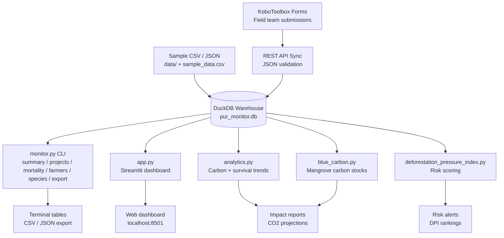

# PUR Monitor

  

PUR Monitor is a Nature-Based Solutions (NbS) field-project monitoring toolkit for PUR Latin America. It ingests KoboToolbox field submissions into a DuckDB warehouse, then exposes portfolio KPIs, per-project progress, tree-mortality analysis, farmer demographics, carbon-sequestration projections, and survival-trend analytics through a Streamlit dashboard and a Rich-powered CLI — currently tracking five concurrent reforestation projects across Peru, Colombia, and Brazil.

## Features

- **Portfolio KPI tracking** — active farmers, active parcels, trees planned vs. alive, survival rate, and area-under-planting rolled up against per-project targets (`monitor.py summary`).
- **Per-project progress & targets** — country-level breakdown of farmers and trees with target achievement percentages (`monitor.py projects`).
- **Tree-mortality analytics** — ranks causes of loss (pest/disease, animal damage, flooding, etc.) by incident count and total trees lost (`monitor.py mortality`).
- **Farmer demographics** — gender balance and active-farmer rate per project, with color-coded thresholds (`monitor.py farmers`).
- **Species distribution** — active-parcel breakdown by species, total trees, and average area (`monitor.py species`).
- **CSV / JSON export** — portfolio snapshot for external reporting (`monitor.py export [csv|json]`).
- **Carbon sequestration analytics** (`analytics.py`) — annual, 10-year, and 30-year CO2 projections with species-specific rates.
- **Survival-trend analytics** (`analytics.py`) — rolling-window trend on tree survival across visits per parcel.
- **Blue-carbon module** (`blue_carbon.py`) — mangrove/wetland carbon-stock estimation for coastal plots.
- **Deforestation Pressure Index** (`deforestation_pressure_index.py`) — composite risk index combining proximity, trend, and biophysical signals.
- **Streamlit dashboard** (`app.py`) — live KPI tiles, project charts, and maps on `localhost:8501`.
- **KoboToolbox integration** — JSON payload validation and sync into DuckDB with plausibility checks.

## Architecture



## Quick Start

```bash
git clone https://github.com/achmadnaufal/pur-monitor.git
cd pur-monitor
pip install -r requirements.txt

# One-line demo (reads pur_monitor.db and prints portfolio KPIs)
python3 demo/run_demo.py

# Or launch the Streamlit dashboard
./run.sh     # equivalent to: streamlit run app.py
```

## Usage

### CLI demo

```
$ python3 demo/run_demo.py
==============================================================
  PUR Monitor — KPI Demo
  NbS Field Project Monitoring (Latin America)
==============================================================

Portfolio KPI Summary:
  Projects active       : 5
  Active farmers        : 102/200 (51.0% of target)
  Active parcels        : 100/410
  Trees planned         : 97,354
  Trees alive (latest)  : 86,317
  Survival rate         : 88.7%

Per-Project Breakdown:
  Country    Project                         Farmers     Trees
  ------------------------------------------------------------
  Peru       Sample Reforestation Project A       12    21,511
  Peru       Sample Reforestation Project B        8    13,833
  Colombia   Sample Reforestation Project C       14    20,896
  Colombia   Sample Agroforestry Project D         9    18,174
  Brazil     Sample Reforestation Project E       13    22,940

Top Mortality Causes:
  Cause                        Incidents  Tree Loss
  --------------------------------------------------
  Poor Planting Technique            100      1,928
  Animal Damage                       96      1,865
  Flooding                            94      1,837
  Unknown                             85      1,557
  Pest/Disease                        83      1,325

Farmer Demographics:
  F: 24 (42.9%)
  M: 32 (57.1%)
  Active rate: 54/56 (96.4%)

==============================================================
  Demo complete — Launch Streamlit app:
     streamlit run app.py
==============================================================
```

### Rich CLI (`monitor.py summary`)

```
$ python3 monitor.py summary
╭────────────────────────────────────────╮
│ PUR Latin America — Monitoring Summary │
╰────────────────────────────────────────╯
╭──────────────────────┬────────┬────────┬───────────────╮
│ KPI                  │ Actual │ Target │ % Achievement │
├──────────────────────┼────────┼────────┼───────────────┤
│ Projects             │      5 │      5 │             — │
│ Active Farmers       │     54 │    200 │         27.0% │
│ Active Parcels       │     99 │    410 │         24.1% │
│ Trees Planted        │ 96,686 │ 75,000 │             — │
│ Trees Alive (latest) │ 86,317 │ 75,000 │        115.1% │
│ Area to Plant (ha)   │  323.0 │  605.0 │         53.4% │
╰──────────────────────┴────────┴────────┴───────────────╯
```

### Python API — carbon sequestration

```python
from analytics import PURAnalytics

analytics = PURAnalytics("pur_monitor.db")
carbon = analytics.calculate_carbon_sequestration()

print(f"Trees alive: {carbon['total_trees_alive']}")
print(f"Annual CO2: {carbon['avg_annual_carbon_tonnes']:.2f} t")
print(f"10-year:    {carbon['10_year_projection_tonnes']:.2f} t")
print(f"30-year:    {carbon['30_year_projection_tonnes']:.2f} t")
```

### Python API — survival trend

```python
trend = analytics.calculate_survival_trend(window_visits=3)
print(f"Portfolio trend:    {trend['trend_direction']}")
print(f"Earliest survival:  {trend['avg_survival_first_visit_pct']:.1f}%")
print(f"Latest survival:    {trend['avg_survival_latest_visit_pct']:.1f}%")
print(f"Change:             {trend['change_pct_points']:+.1f} pp")
```

## Tech Stack

- **Language:** Python 3.10+
- **Storage:** DuckDB (`pur_monitor.db`) — embedded, zero-server analytics engine
- **Dashboard:** Streamlit + Plotly
- **CLI:** Rich (tables, panels, color)
- **Data:** pandas for dataframe ops; KoboToolbox JSON for field ingestion
- **Testing:** pytest (`tests/` covers core KPIs, blue-carbon, DPI, survival trend, data validation)

## Project Structure

```
pur-monitor/
├── app.py                               # Streamlit dashboard
├── monitor.py                           # Rich CLI commands
├── analytics.py                         # Carbon + survival trend analytics
├── blue_carbon.py                       # Mangrove/wetland carbon stocks
├── deforestation_pressure_index.py      # DPI risk scoring
├── setup.py                             # DuckDB schema + seed
├── queries.sql                          # SQL schema definitions
├── run.sh                               # Launches Streamlit
├── pur_monitor.db                       # DuckDB warehouse (tracked demo fixture)
├── sample_data.csv                      # Sample parcel/farmer snapshot
├── demo/
│   └── run_demo.py                      # Standalone KPI demo (no Rich required)
├── data/                                # Additional sample payloads
├── tests/                               # pytest suite
├── requirements.txt
├── LICENSE
└── README.md
```

## License

MIT — see [LICENSE](LICENSE).

## Changelog

See [CHANGELOG.md](CHANGELOG.md) for version history.

---

> Built by [Achmad Naufal](https://github.com/achmadnaufal) | Lead Data Analyst | Power BI · SQL · Python · GIS
