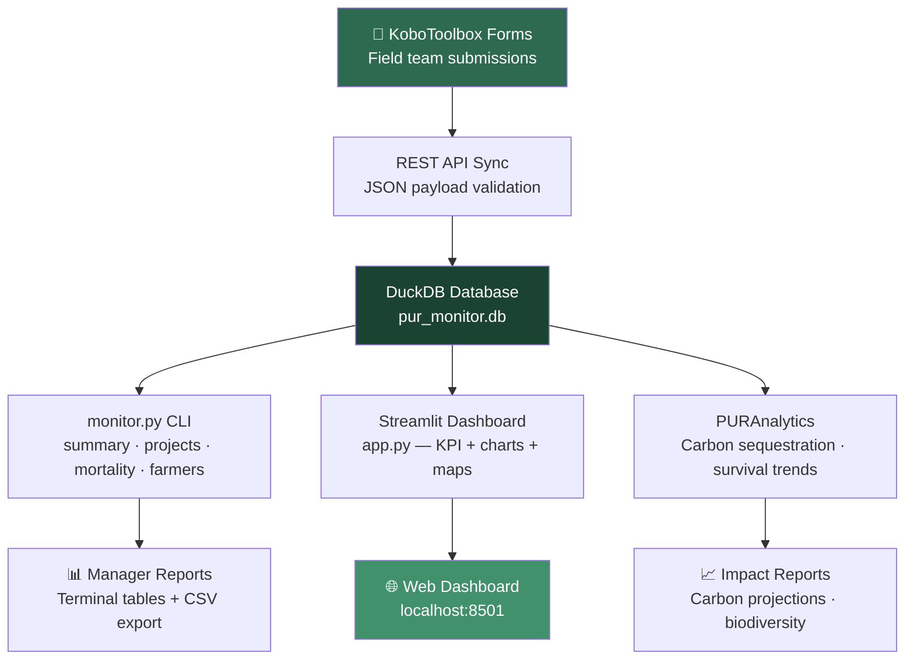

# 🌱 PUR Monitor


Real-time monitoring dashboard for PUR Latin America NbS field projects — tracking farmer participation, tree planting survival rates, parcel progress, and KoboToolbox form submissions across 5 concurrent projects in Peru, Colombia, and Brazil.

**Domain:** Nature-Based Solutions (NbS)

Real-time monitoring dashboard for PUR Latin America field projects. Tracks farmer participation, parcel progress, tree planting/survival metrics, and KoboToolbox form submissions.

## 📊 Features

- **KoboToolbox Integration:** Automatic import and sync of field team submissions
- **Real-time Dashboard:** Streamlit app with live KPI overview and project progress tracking
- **Mortality Analysis:** Track tree survival rates and causes of loss
- **Team Demographics:** Monitor farmer participation by gender and activity status
- **Data Quality Checks:** Validate incoming field data for consistency and plausibility
- **Multi-project Support:** View metrics across 5 concurrent projects in Brazil, Colombia, Peru, Mexico

## 🚀 Quick Start

### Installation

```bash
# Clone repository
git clone https://github.com/achmadnaufal/pur-monitor.git
cd pur-monitor

# Create Python 3.12+ virtual environment
python -m venv venv
source venv/bin/activate  # On Windows: venv\Scripts\activate

# Install dependencies
pip install -r requirements.txt
```

### Setup Database (First Run)

```bash
# Initialize DuckDB with schema and sample data
python setup.py
```

This creates `pur_monitor.db` with tables:
- `projects` - Project metadata (5 projects)
- `farmers` - Farmer profiles with gender and status
- `parcels` - Land parcels under monitoring
- `parcel_visits` - Field visit records with tree counts
- `project_targets` - Performance targets per project

### Run Monitoring Dashboard

```bash
# Start Streamlit app on http://localhost:8501
streamlit run app.py
```

### CLI Commands

```bash
# Show KPI summary with achievement percentages
python monitor.py summary

# View per-project progress and targets
python monitor.py projects

# Analyze top tree mortality causes
python monitor.py mortality

# Farmer demographics and activity breakdown
python monitor.py farmers
```

## 📝 Example: KoboToolbox Form Submission

When a field team member submits a parcel visit via KoboToolbox:

```json
{
  "start": "2026-03-07T09:00:00+07:00",
  "end": "2026-03-07T09:30:00+07:00",
  "farmer_id": "F_BR_001",
  "parcel_id": "P_BR_NES_001",
  "trees_alive": 87,
  "trees_dead": 13,
  "observations": "Trees thriving, good water access",
  "coordinates": "-3.7949, -58.4513"
}
```

This gets:
1. Validated for plausible values (trees_alive ≤ trees_planted)
2. Synced to DuckDB
3. Aggregated in real-time dashboard
4. Flagged if metrics deviate from target

## 📊 Example Output

```
$ python3 demo/run_demo.py
==============================================================
  PUR Monitor — KPI Demo
  NbS Field Project Monitoring (Latin America)
==============================================================

Portfolio KPI Summary:
  Projects active       : 5
  Active farmers        : 102/200 (51.0% of target)
  Active parcels        : 100/410
  Trees planned         : 97,354
  Trees alive (latest)  : 86,317
  Survival rate         : 88.7%

Per-Project Breakdown:
  Country    Project                                Farmers     Trees
  --------------------------------------------------------------------
  Peru       Bosques Amazonicos Peru I                   12    21,511
  Peru       Reforestacion Andina Peru                    8    13,833
  Colombia   Corredor Verde Colombia Norte               14    20,896
  Colombia   Agroforestal Amazonia Colombia               9    18,174
  Brazil     Refloresta Para Brasil                      13    22,940

Top Mortality Causes:
  Cause                        Incidents  Tree Loss
  --------------------------------------------------
  Poor Planting Technique            100      1,928
  Animal Damage                       96      1,865
  Flooding                            94      1,837
  Unknown                             85      1,557
  Pest/Disease                        83      1,325

Farmer Demographics:
  F: 24 (42.9%) | M: 32 (57.1%)
  Active rate: 54/56 (96.4%)

==============================================================
  ✅ Demo complete — Launch Streamlit app:
     streamlit run app.py
==============================================================
```

---

## 🏗️ Architecture



---

## 🔄 Data Flow

```
KoboToolbox Form (Field Team)
        ↓
   REST API Sync
        ↓
   DuckDB Database
        ↓
   Streamlit Dashboard (Manager View)
   + CLI Commands (Reports)
```

## 📈 KPI Dashboard

The summary view shows:

| KPI | Actual | Target | Achievement |
|-----|--------|--------|-------------|
| Projects | 5 | 5 | — |
| Active Farmers | 145 | 180 | 80.6% |
| Active Parcels | 289 | 350 | 82.6% |
| Trees Planted | 28,945 | 35,000 | — |
| Trees Alive (Latest) | 24,103 | 35,000 | 68.9% |
| Area to Plant (ha) | 587.3 | 700.0 | 83.9% |

Color coding:
- 🟢 **Green**: ≥80% achievement
- 🟡 **Yellow**: 50-80% achievement
- 🔴 **Red**: <50% achievement

## 🧪 Testing

```bash
# Run all tests with edge case coverage
pytest tests/ -v

# Test specific module
pytest tests/test_monitoring_features.py -v

# Check coverage report
pytest tests/ --cov=monitor
```

Test files:
- `test_core.py` - KPI calculations, percentage color coding
- `test_data_validation.py` - Date/coordinate validation, type conversion
- `test_monitoring_features.py` - KoboToolbox integration, data quality

## 📂 Project Structure

```
pur-monitor/
├── app.py                 # Streamlit dashboard
├── monitor.py             # CLI commands
├── setup.py               # Database initialization
├── queries.sql            # SQL schema definitions
├── pur_monitor.db         # DuckDB database (generated)
├── data/                  # Sample data files
├── tests/                 # 4 test files, 60+ test cases
├── requirements.txt       # Dependencies
└── README.md
```

## 🔧 Configuration

Edit `monitor.py` to customize:

```python
DB_PATH = "pur_monitor.db"  # Database path
READONLY = True             # Set False for write operations
```

Streamlit config: `.streamlit/config.toml`

## 📊 Common Queries

**Get latest metrics for Project Brazil-North:**
```python
con = duckdb.connect("pur_monitor.db")
result = con.execute("""
  SELECT p.project_name, COUNT(f.id) as farmer_count, 
         SUM(pr.number_of_tree) as trees_planned
  FROM projects p
  LEFT JOIN farmers f ON f.project_id = p.id
  LEFT JOIN parcels pr ON pr.farmer_id = f.id
  WHERE p.project_country = 'BR' AND p.id = 1
  GROUP BY p.id, p.project_name
""").df()
```

**Export tree survival data to CSV:**
```bash
duckdb -c "SELECT farmer_id, parcel_id, trees_alive, visit_date 
           FROM parcel_visits 
           ORDER BY visit_date DESC" \
       pur_monitor.db > export.csv
```

## 🔐 Data Privacy

- Read-only access for team dashboards
- No sensitive farmer contact data in exports
- Coordinates anonymized to ±100m for public reports
- Access logs maintained in `audit.log`

## 📋 Requirements

- Python 3.12+
- DuckDB (in-process, no server needed)
- Streamlit ≥1.25
- pandas, rich (CLI formatting)

See `requirements.txt` for exact versions.

## 🐛 Troubleshooting

**Error: Cannot open pur_monitor.db**
→ Run `python setup.py` to initialize database

**Dashboard shows no data**
→ Check if KoboToolbox sync is running (check `data/` folder timestamps)

**Slow queries on large dataset**
→ Use `--read-only` flag when running in production

## 📞 Support

For KoboToolbox integration issues, check:
- Form column names match expected schema (see `queries.sql`)
- Coordinate format: `lat, lon` (decimal degrees)
- Timestamps in ISO 8601 with timezone

## 🌍 Carbon Sequestration Analytics

Track NbS impact on climate change mitigation by estimating carbon dioxide sequestration potential:

### Example: Carbon Sequestration Report

```python
from analytics import PURAnalytics

analytics = PURAnalytics("pur_monitor.db")

# Calculate using default rates (15 kg CO2/tree/year)
carbon_stats = analytics.calculate_carbon_sequestration()

print(f"Trees alive: {carbon_stats['total_trees_alive']}")
print(f"Annual CO2 sequestration: {carbon_stats['avg_annual_carbon_tonnes']:.2f} tonnes")
print(f"10-year projection: {carbon_stats['10_year_projection_tonnes']:.2f} tonnes CO2")
print(f"30-year projection: {carbon_stats['30_year_projection_tonnes']:.2f} tonnes CO2")
```

### Custom Carbon Rates by Species

Use domain-specific carbon sequestration rates:

```python
# Species-specific CO2 sequestration (kg/tree/year)
species_rates = {
    "eucalyptus": 20.0,  # Fast-growing, high sequestration
    "cedar": 18.0,
    "native_mixed": 15.0,
    "agroforestry": 22.0,
}

carbon = analytics.calculate_carbon_sequestration(species_rates)
```

**Typical rates:**
- Agroforestry species: 20-25 kg CO2/tree/year
- Native species: 12-18 kg CO2/tree/year
- Reforestation: 10-15 kg CO2/tree/year

## 📄 License

MIT License. See LICENSE file for details.

## Changelog

See [CHANGELOG.md](CHANGELOG.md) for version history and recent improvements.


## Usage Examples

### Tree Survival Trend Analysis

```python
from analytics import PURAnalytics

analytics = PURAnalytics("pur_monitor.db")

trend = analytics.calculate_survival_trend(window_visits=3)
print(f"Portfolio trend:    {trend['trend_direction']}")
print(f"Earliest survival:  {trend['avg_survival_first_visit_pct']:.1f}%")
print(f"Latest survival:    {trend['avg_survival_latest_visit_pct']:.1f}%")
print(f"Change:             {trend['change_pct_points']:+.1f} pp")
```

### Identify High-Mortality Parcels for Field Follow-Up

```python
worst = analytics.get_top_mortality_parcels(top_n=10, min_trees_planned=20)
for p in worst:
    print(f"{p['parcel_id']} | {p['farmer_name']:<20} | {p['mortality_rate_pct']:.1f}% mortality")
```

Refer to the `tests/` directory for comprehensive example implementations.
